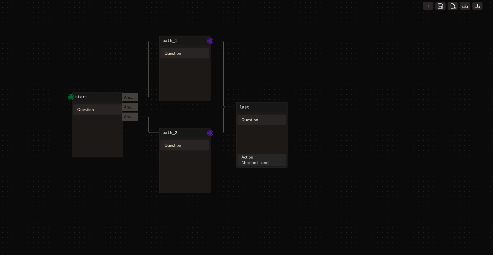

# Chatbot Editor

This package provides a chatbot editor for creating and managing scripted chatbots to use with the [Chatbot Library](https://github.com/MacaronFR/chatbot).



## Installation

`npm install chatbot-editor`

## Usage

```tsx
<ChatbotEditor save={save} load={load} export={download} import={importFile} init={init} autosaveInterval={1000}/>
```

You just need to use the `<ChatbotEditor/>` component to use the editor. All parameters are optional.

### Parameters
- `save`: Function to save the chatbot editor data (questions, answers, actions and goto). You get the JS Object as a parameter.
- `load`: Function to load the chatbot editor data. You have to return a promise with the data. The editor does validations.
- `export`: Function to export the chatbot data. You get the JS Object as a parameter.
- `import`: Function to import the chatbot data into editor data. Return a promise with the JS Object. The editor does validations.
- `init`: Function to initialize the chatbot editor data. If the function changes, the editor will call the new function.
- `autosaveInterval`: Interval in milliseconds for launching the save function. (If no save function is provided, there is no autosave)

## Author

This project is maintained by [MacaronFR](https://github.com/MacaronFR).